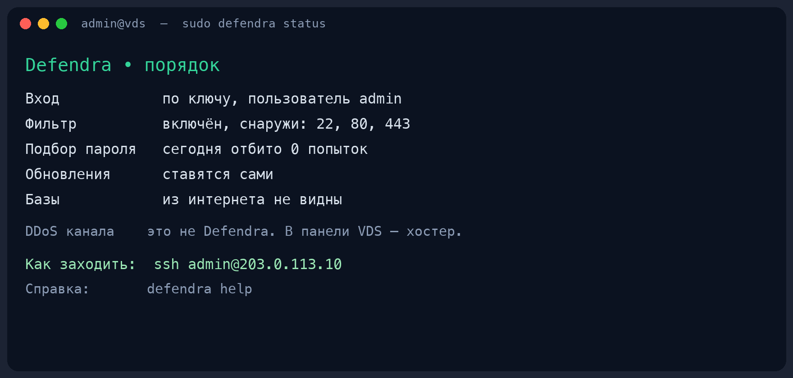

<p align="center">
  
</p>

<h1 align="center">Defendra</h1>

<p align="center">
  Защита свежего Ubuntu VDS для человека, который не админ.<br>
  Одна команда, русский язык, без облака и телеметрии.
</p>

<p align="center">
  
  
  
  
  
</p>

<p align="center">
  
</p>

```text
sudo apt install ./defendra.deb
sudo defendra protect
```

Через минуту вход по паролю SSH закрыт, root с улицы не пускают, фильтр портов включён, базы не торчат в интернет. Сайт и Docker не ломаются.

## Что делает

| Проблема свежего VDS | Что делает Defendra |
|---|---|
| Подбор пароля SSH за ночь | Ключ, потом пароль выключается |
| Вход под `root` с улицы | Только пользователь `admin` |
| Открытый Redis / Postgres / MySQL | Прячет на localhost, контейнеры не трогает |
| Нет файрвола | Включает фильтр, оставляет 22 и уже работающие порты сайта |
| Забыли открыть сайт | `sudo defendra allow-site` — не гуглите, как выключить фильтр |

Повторный запуск безопасен. Ctrl+C посредине — снова `sudo defendra protect`.

## Честно не делает

Большую атаку на канал (гигабиты мусора до сервера) программа на машине не остановит. Это защита хостера в панели VDS и Cloudflare. В статусе это написано прямо, не мелким шрифтом.

Не меняет SSH-порт, не ставит 2FA, не перезагружает сервер сама.

## Как поставить

Нужен Ubuntu 22.04 или 24.04, amd64. Команды — **на сервере**, кроме входа по SSH.

**1.** Войдите с компьютера (пароль из письма хостера, буквы не печатаются):

```bash
ssh root@СЮДА_IP_ИЗ_ПИСЬМА
```

**2.** Поставьте пакет:

```bash
curl -fsSL https://github.com/johnkaine45/defendra/releases/latest/download/defendra_amd64.deb -o defendra.deb
sudo apt install ./defendra.deb
```

Нет `curl`? `sudo apt install curl` и повторите. Процессор ARM (`uname -m` пишет `aarch64`) — файл `defendra_arm64.deb`.

**3.** Включите защиту:

```bash
sudo defendra protect
```

Ключ делают **на своём компьютере**, в другом окне. Вставляют строку из `.pub` (короткая, начинается с `ssh-ed25519`). Закрытый ключ вставлять нельзя.

**4.** Это окно не закрывайте. В другом окне у себя:

```bash
ssh admin@СЮДА_IP
```

Вошли — первое окно можно закрыть. Не вошли — консоль в панели хостера (VNC), пароль root **из письма**, затем `sudo defendra undo`.

Пароль, который покажет Defendra — только для `sudo` на сервере. Для SSH он не нужен.

**5.** Сайт на второй день — не выключайте фильтр:

```bash
sudo defendra allow-site
```

## Как выглядит статус

<p align="center">
  
</p>

Три слова вместо светофора: **порядок** / **не полностью** / **опасно**. Одна причина, одна команда. Повторный `protect` на уже закрытом сервере пишет «проверил, менять нечего» и не гоняет девять шагов.

## Команды

| Команда | Зачем |
|---|---|
| `defendra` | Меню: что делать дальше |
| `sudo defendra protect` | Настроить или дожать защиту |
| `sudo defendra status` | Всё ли в порядке |
| `sudo defendra allow-site` | Открыть сайту 80 и 443 |
| `sudo defendra undo` | Откатить последний protect |
| `defendra how-to-login` | Как заходить, два пароля, консоль хостера |
| `defendra help` | FAQ: не вхожу, забыли пароль, нет сайта |
| `sudo defendra password` | Показать пароль sudo, если забыли |

Для скриптов: `--yes`, `--dry-run`, `scan --format json`. В меню новичка их нет.

## Принципы

- Говорит по-русски, без жаргона вроде UFW и fail2ban
- Сначала гарантирует следующий вход, потом закрывает дыры
- Не останавливает Docker, не сбрасывает фильтр, не меняет порт SSH
- Пароль root из письма хостера не трогает — им открывают консоль, если что-то пошло не так
- Не ходит «домой», нет кабинета и телеметрии

## Документы

- [UX.md](UX.md) — экраны и фразы
- [SPEC.md](SPEC.md) — что именно настраивается
- [ARCHITECTURE.md](ARCHITECTURE.md) — как устроен код
- [SECURITY.md](SECURITY.md) — как сообщить об уязвимости

## Разработка

Нужен Go 1.23+.

```bash
make test
make linux          # bin/defendra-linux-amd64
make deb            # dist/defendra_VERSION_amd64.deb
```

Деплой на свой стенд:

```bash
export DEFENDRA_HOST=admin@203.0.113.10
export DEFENDRA_KEY=~/.ssh/id_ed25519
make deploy
```

## Лицензия

[MIT](LICENSE)
